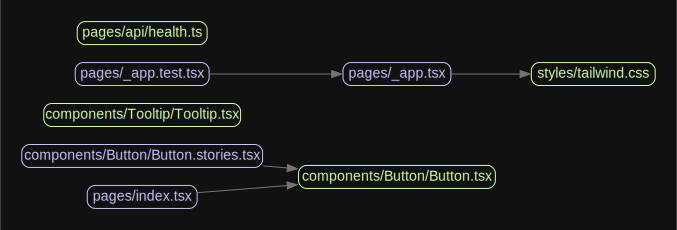

# Whispers in the Dark


Welcome to the _Whispers in the Dark_, an open-source game.

## Table of Contents

- [Whispers in the Dark](#whispers-in-the-dark)
  - [Table of Contents](#table-of-contents)
  - [🎯 Getting Started](#🎯-getting-started)
  - [Environment variables](#environment-variables)
  - [� Scripts Overview](#📃-scripts-overview)
  - [🔗 Coupling Graph](#🔗-coupling-graph)
  - [🧪 Testing](./wiki/testing.md#🧪-testing)
    - [Running Tests](./wiki/testing.md#running-tests)
    - [Acceptance Tests](./wiki/testing.md#acceptance-tests)
    - [Smoke Testing](./wiki/testing.md#smoke-testing)
  - [🎨 Styling and Design System](#🎨-styling-and-design-system)
    - [CVA - A New Approach to Variants](#cva---a-new-approach-to-variants)
  - [💾 State Management](#💾-state-management)
    - [Zustand](#zustand)
    - [Jotai](#jotai)
    - [Recoil](#recoil)
  - [🤖 ChatGPT Code Review](#🤖-chatgpt-code-review)
  - [💻 Environment Variables handling](#💻-environment-variables-handling)
  - [🤝 Contribution](#🤝-contribution)
  - [Support](#support)
  - [📜 License](#📜-license)
  - [Contributors](#contributors)

## 🎯 Getting Started

To get started with, follow these steps:

1. Fork & clone repository:

```bash
## Don't forget to ⭐ star and fork it first :)
git clone https://github.com/tomek-i/whispers-in-the-dark.git
```

2. Install the dependencies:

```bash
yarn install --frozen-lockfile
```

3. Run the development server:

```bash
yarn dev
```

4. Open [http://localhost:3000](http://localhost:3000) with your browser to see the result.

5. This project uses a git hook to enforce [conventional commits](https://github.com/qoomon/git-conventional-commits). To install the git hook, run the following command in the root directory of the project:

```sh
brew install pre-commit
pre-commit install -t commit-msg
```

## Environment variables

```js
NEXT_PUBLIC_FIREBASE_API_KEY=
NEXT_PUBLIC_FIREBASE_AUTH_DOMAIN=
NEXT_PUBLIC_FIREBASE_PROJECT_ID=
NEXT_PUBLIC_FIREBASE_STORAGE_BUCKET=
NEXT_PUBLIC_FIREBASE_MESSAGING_SENDER_ID=
NEXT_PUBLIC_FIREBASE_APP_ID=
NEXT_PUBLIC_FIREBASE_MEASUREMENT_ID=
NEXT_PUBLIC_FIREBASE_DATABASE_URL=
```

## 📃 Scripts Overview

The following scripts are available in the `package.json`:

- `dev`: Starts the development server with colorized output
- `build`: Builds the app for production
- `start`: Starts the production server
- `lint`: Lints the code using ESLint
- `lint:fix`: Automatically fixes linting errors
- `prettier`: Checks the code for proper formatting
- `prettier:fix`: Automatically fixes formatting issues
- `analyze`: Analyzes the bundle sizes for Client, Server and Edge environments
- `storybook`: Starts the Storybook server
- `build-storybook`: Builds the Storybook for deployment
- `test`: Runs unit and integration tests
- `e2e:headless`: Runs end-to-end tests in headless mode
- `e2e:ui`: Runs end-to-end tests with UI
- `format`: Formats the code with Prettier
- `plop`: Runs plop to assist generating new files
- `postinstall`: Applies patches to external dependencies
- `preinstall`: Ensures the project is installed with Yarn
- `coupling-graph`: **Generates a coupling and cohesion graph for the components**

## 🔗 Coupling Graph

The `coupling-graph` script is a useful tool that helps visualize the coupling and connections between your project's internal modules. It's built using the [Madge](https://github.com/pahen/madge) library. To generate the graph, simply run the following command:

```bash
yarn coupling-graph
```

This will create a `graph.svg` file, which contains a graphical representation of the connections between your components. You can open the file with any SVG-compatible viewer.



## 🎨 Styling and Design System

This project uses Tailwind CSS for styling and CVA for creating a powerful, easy-to-use design system. If you want to learn more about the setup, check out this fantastic video by Vercel:

[](https://www.youtube.com/watch?v=T-Zv73yZ_QI&ab_channel=Vercel)

### CVA - A New Approach to Variants

While CSS-in-TS libraries such as [Stitches](https://stitches.dev/) and [Vanilla Extract](https://vanilla-extract.style/) are great for building type-safe UI components, they might not be the perfect fit for everyone. You may prefer more control over your stylesheets, need to use a framework like Tailwind CSS, or simply enjoy writing your own CSS.

Creating variants using traditional CSS can be a tedious task, requiring you to manually match classes to props and add types. CVA is here to take that pain away, allowing you to focus on the enjoyable aspects of UI development. By providing an easy and type-safe way to create variants, CVA simplifies the process and helps you create powerful design systems without compromising on the flexibility and control of CSS.

## 💾 State Management

While this boilerplate doesn't include a specific state management library, we believe it's essential for you to choose the one that best suits your project's needs. Here are some libraries we recommend for state management:

### Zustand

[Zustand](https://github.com/pmndrs/zustand) is a small, fast, and scalable state management library. It's designed to be simple and intuitive, making it a great choice for small to medium-sized projects. It's also optimized for bundle size, ensuring minimal impact on your app's performance.

### Jotai

[Jotai](https://github.com/pmndrs/jotai) is an atom-based state management library for React that focuses on providing a minimal and straightforward API. Its atom-based approach allows you to manage your state in a granular way while still being highly optimized for bundle size.

### Recoil

[Recoil](https://recoiljs.org/) is a state management library developed by Facebook, specifically designed for React applications. By utilizing atoms and selectors, Recoil allows you to efficiently manage state and derived state. Its key benefit is the ability to update components only when the state they're subscribed to changes, reducing unnecessary re-renders and keeping your application fast and efficient. Recoil also offers great developer experience with built-in debugging tools.

Choose the library that best fits your requirements and project structure to ensure an efficient state management solution for your application.

## 🤖 ChatGPT Code Review

We've integrated the innovative [ChatGPT Code Review](https://github.com/anc95/ChatGPT-CodeReview) for AI-powered, automated code reviews. This feature provides real-time feedback on your code, helping improve code quality and catch potential issues.

To use ChatGPT Code Review, add an `OPENAI_API_KEY` environment variable with an appropriate key from the OpenAI platform. For setup details, refer to the [Using GitHub Actions](https://github.com/anc95/ChatGPT-CodeReview#using-github-actions) section in the documentation.

## 💻 Environment Variables handling

[T3 Env](https://env.t3.gg/) is a library that provides environmental variables checking at build time, type validation and transforming. It ensures that your application is using the correct environment variables and their values are of the expected type. You’ll never again struggle with runtime errors caused by incorrect environment variable usage.

Config file is located at `env.mjs`. Simply set your client and server variables and import `env` from any file in your project.

```ts
export const env = createEnv({
  server: {
    // Server variables
    SECRET_KEY: z.string(),
  },
  client: {
    // Client variables
    API_URL: z.string().url(),
  },
  runtimeEnv: {
    // Assign runtime variables
    SECRET_KEY: process.env.SECRET_KEY,
    API_URL: process.env.NEXT_PUBLIC_API_URL,
  },
})
```

If the required environment variables are not set, you'll get an error message:

```sh
  ❌ Invalid environment variables: { SECRET_KEY: [ 'Required' ] }
```

## 🤝 Contribution

Contributions are always welcome! To contribute, please follow these steps:

1. Fork the repository.
2. Create a new branch with a descriptive name.
3. Make your changes, and commit them using the [Conventional Commits](https://www.conventionalcommits.org/) format.
4. Push your changes to the forked repository.
5. Create a pull request, and we'll review your changes.

## Support

If you're looking for help or simply want to share your thoughts about the project, we encourage you to join.

## 📜 License

This project is licensed under the MIT License. For more information, see the [LICENSE](./LICENSE) file.

## Contributors

<!-- ALL-CONTRIBUTORS-LIST:START - Do not remove or modify this section -->
<!-- prettier-ignore-start -->
<!-- markdownlint-disable -->

<!-- markdownlint-restore -->
<!-- prettier-ignore-end -->

<!-- ALL-CONTRIBUTORS-LIST:END -->

<!-- Badges and links -->
